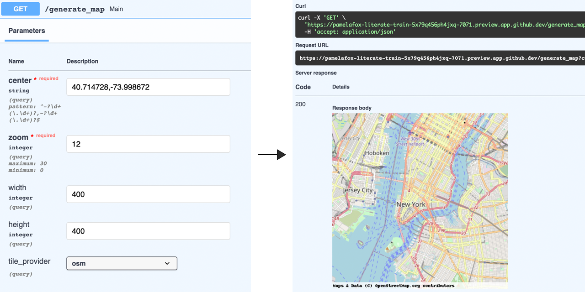

This repository creates a Static Maps API using the FastAPI framework and the py-staticmaps package.
The API accepts query parameters to customize each map and responds with a PNG image.
The code is tested with pytest, linted with ruff, and formatted with black.



This API is designed to be deployed as an Azure Function with an Azure CDN in front.


## Opening the project

This project has Dev Container support, so it will be automatically setup if you open it in Github Codespaces or in local VS Code with the Dev Containers extension.

If you're unable to open the Dev Container, then you'll need to:

1. Create a [Python virtual environment](https://docs.python.org/3/tutorial/venv.html#creating-virtual-environments) and activate it.

2. Install requirements:

    ```shell
    pip3 install --user -r requirements-dev.txt
    ```

3. Install the [Azure Dev CLI](https://learn.microsoft.com/azure/developer/azure-developer-cli/install-azd).

## Local development

Use the local emulator from Azure Functions Core Tools to test the function locally.
(There is no local emulator for the API Management service).

1. Open this repository in Github Codespaces or VS Code with Remote Dev Containers extension.
2. Open the Terminal and make sure you're in the root folder.
3. Run `func host start`
4. Click 'http://localhost:7071/{*route}' in the terminal, which should open the website in a new tab.

## Deployment

This repo is set up for deployment using the
[Azure Developer CLI](https://learn.microsoft.com/azure/developer/azure-developer-cli/overview),
which relies on the `azure.yaml` file and the configuration files in the `infra` folder.

Steps for deployment:

1. Sign up for a [free Azure account](https://azure.microsoft.com/free/)
2. Run `azd up`. It will prompt you to login and to provide a name (like "fastfunc") and location (like "eastus"). Then it will provision the resources in your account and deploy the latest code.
3. Once it finishes deploying, navigate to the API endpoint URL from the output.

### CI/CD pipeline

This project includes a Github workflow for deploying the resources to Azure
on every push to main. That workflow requires several Azure-related authentication secrets to be stored as Github action secrets. To set that up, run:

```shell
azd pipeline config
```

### Monitoring

The deployed resources include a Log Analytics workspace with an Application Insights dashboard to measure metrics like server response time.

To open that dashboard, run this command once you've deployed:

```shell
azd monitor --overview
```

## Costs

(only provided as an example, as of Nov-2022)

Costs for this architecture are based on incoming traffic / usage, so cost should be near $0 if you're only testing it out, and otherwise increase based on your API usage.

- Azure Functions - Consumption tier: $0.20 per 1 million calls. The first 1 million calls per Azure subscription are free. [Pricing](https://azure.microsoft.com/pricing/details/functions/)
- Storage account - Standard tier (Hot): $0.0255 per used GiB, 	$0.065 per 10,000 write transactions. The account is only used to store the function code, so cost depends on size of function code and number of deploys (but should be quite low). [Pricing](https://azure.microsoft.com/pricing/details/storage/files/)
- Application Insights: $2.88 per GB ingested data. The first 5 GB per billing account are included per month. [Pricing](https://azure.microsoft.com/pricing/details/monitor/)

## Getting help

If you're working with this project and running into issues, please post in [Discussions](/discussions).
